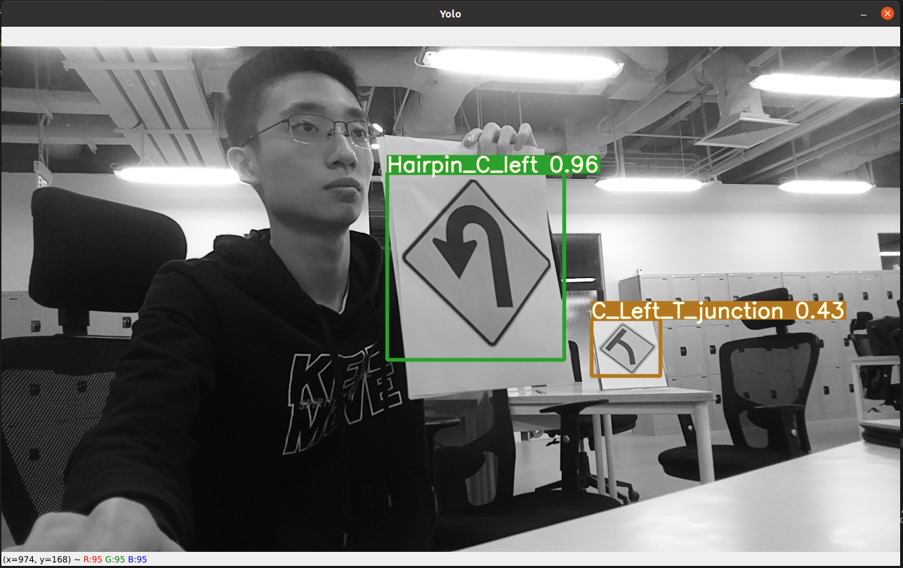
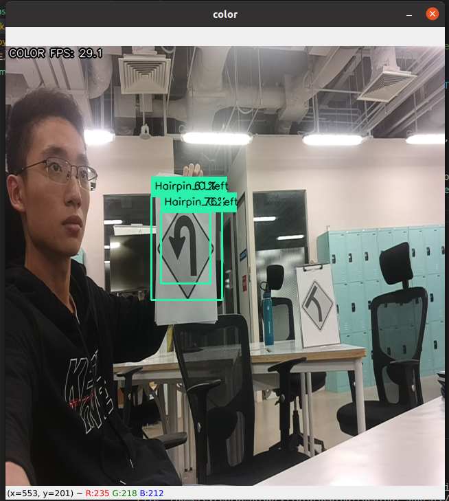

# Yolov7 blob inferencing issue

## **Issue**
- When inferencing with custom yolov7-tiny trained pytorch weights, there is only 1 bounding box with default settings

- When inferencing with converted custom yolov7-tiny trained blob weights, there are multiple bounding boxes with default settings

- When inferencing with converted & non-converted official yolov7-tiny pytorch weights, there is only 1 bounding box per object detected

### **pt inference**

### **blob inference**

## **How to reproduce?**
1. Prep signs dataset & yolov7
    - git clone https://github.com/WongKinYiu/yolov7.git
    - pip install -r requirements.txt
    - pip install torch==1.11.0+cu113 torchvision==0.12.0+cu113 torchaudio==0.11.0 --extra-index-url https://download.pytorch.org/whl/cu113

    - move signs from ./dataset into ./yolov7 dir
    - move signs.yaml from ./dataset into ./yolov7/data dir
    - Optional to print ./dataset/aus_signs.pdf

    **OR**

    - Use trained aus_signs weights from ./weights/best.pt & ./weights/best.blob

2. Train signs dataset with yolov7-tiny weights
    
    **Manual method**
    - cd ./yolov7
    - python3 train.py

        --img 640 640

        --epochs 100 

        --batch-size 16

        --data data/signs.yaml 

        --cfg ./cfg/training/yolov7-tiny.yaml

        --weights yolov7-tiny.pt

        --device 0

        --workers 8

    **Using jupyter notebook**
    - Use yolov7_training.ipynb

3. Convert to blob file
    - Using > https://tools.luxonis.com/ > to convert to blob
    - Insert trained signs yolov7-tiny
    - Insert 640 as image size

4. Run inference
    - cd yolov7_blob_issue

    **Pytorch**
    - Insert local location of yolov7 pt weights into pt_oak.py
    - Insert location of trained coco yolov7-tiny pt weights into pt_oak.py
    - python3 pt_oak.py

    **Blob**
    - Insert location of trained coco yolov7-tiny blob weights into blob_oak.py
    - Insert location of trained coco yolov7-tiny json config into blob_oak.py
    - python3 blob_oak.py